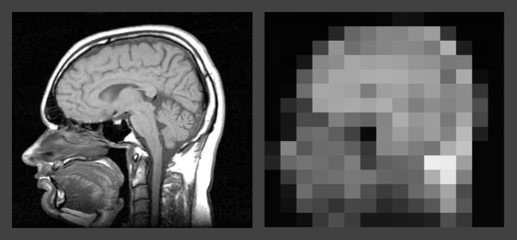
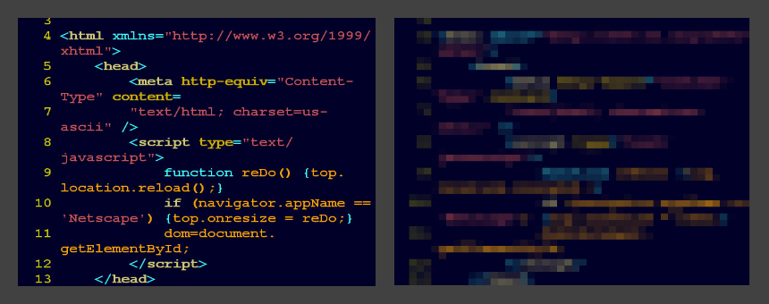

# PIXELATE

Small [processing](http://www.processing.org) program for pixelating images. I often use this kind of images to exemplary explain image filters or fragment shader algorithms.

---
images are from [Wikimedia Commons](http://commons.wikimedia.org/)